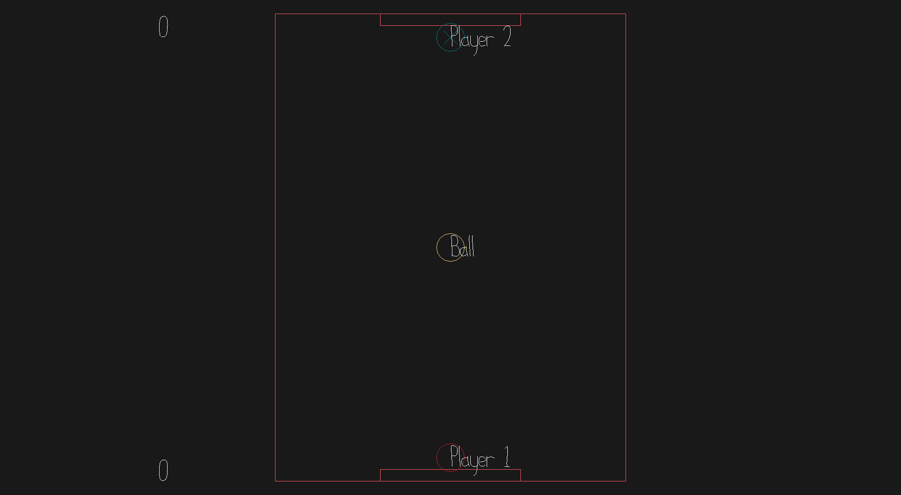

# Land Hockey

Author: Joshua Mathews

Design: Multiplayer game where (ideally) two players try to get the ball into the other player's goal and score the most points

Networking: The main code is in Game.cpp. The client sends the button prompts to the server. The server moves the players and the ball, calculates collisions, checks for goals and updates the score. The client then receives updated ball and player positions as well as the updated score.

Screen Shot:

How To Play:

WASD to move the player, score more than the opponent.

Sources:

This game was built with [NEST](NEST.md).

